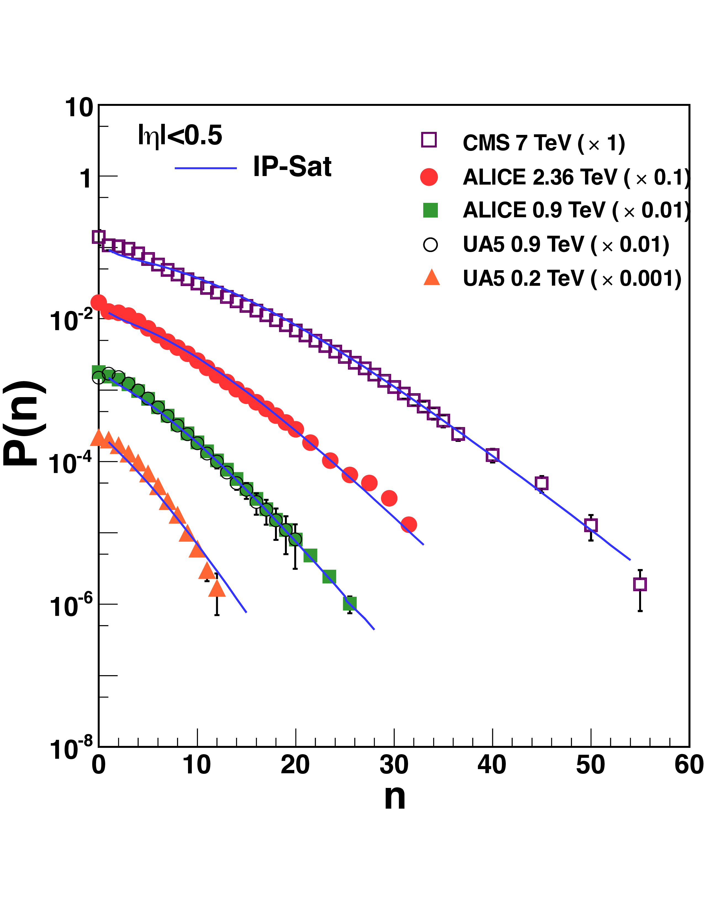
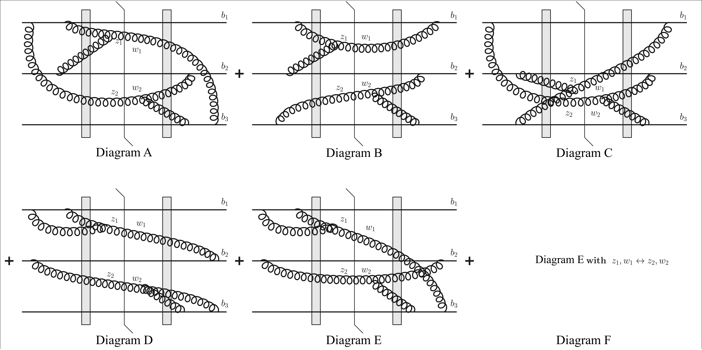
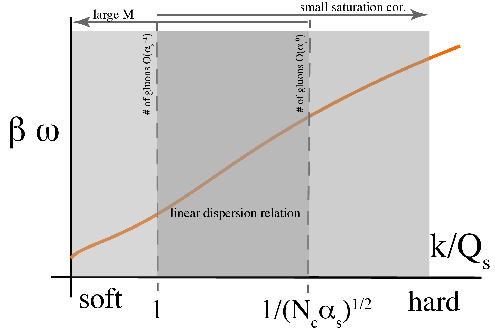
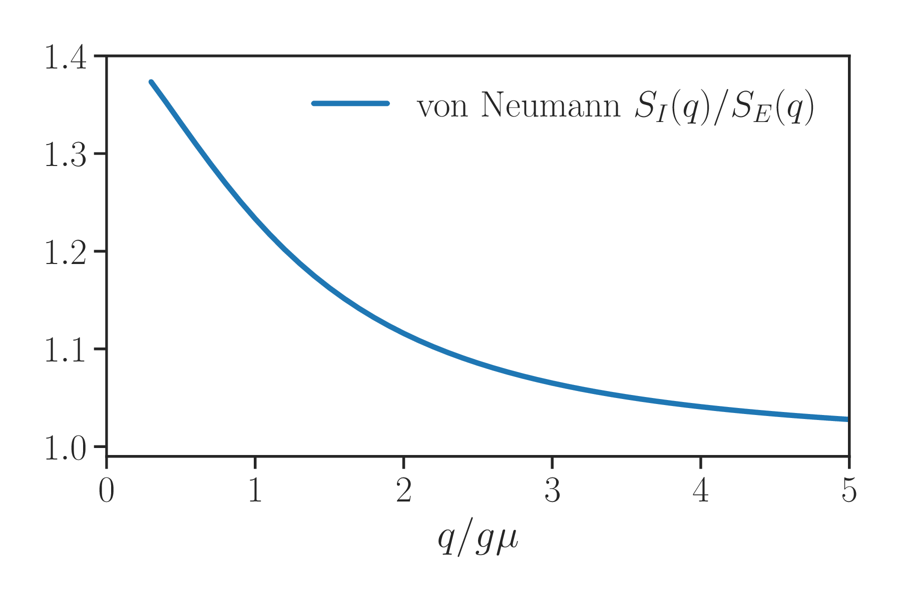
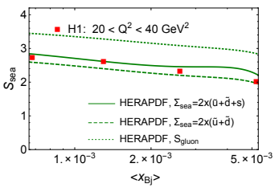
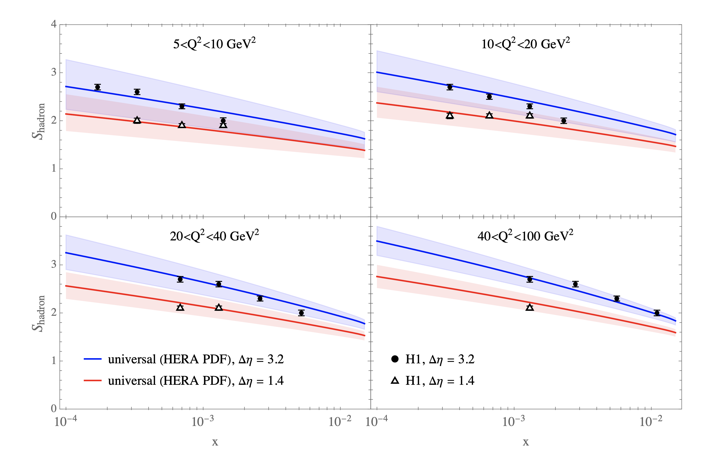
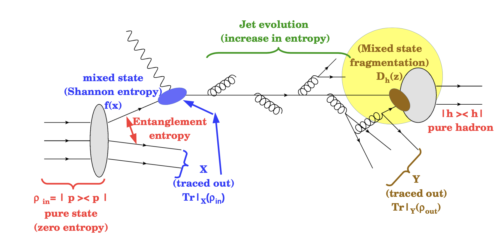
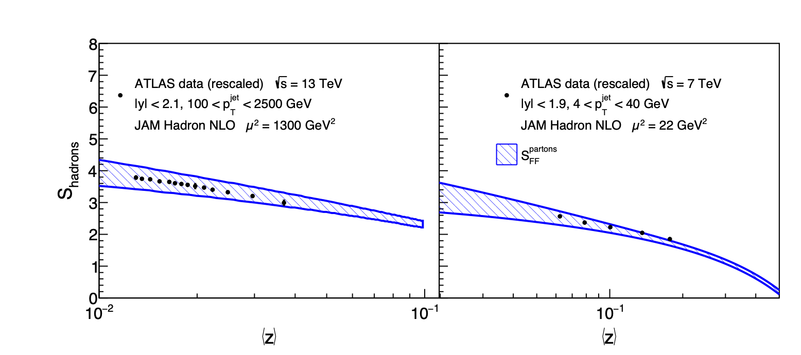

# Entanglement entropy

# for high energy collisions

### Vladi Skokov

#### North Carolina State University

---

### Outline

1. **Review of classical and quantum information theory**

   - Intro to **classical** information theory
   - Intro to **quantum** information theory

2. **Applications to high-energy nuclear collisions**

   - Color Glass Condensate and entanglement in longitudinal momentum

     - Small x evolution of the reduced density matrix
     - Small x evolution of the entanglement entropy

   - Kharzeev-Levin hypothesis and applications (short review of literature)
   - Open questions

---

### Teaser: the Paradox of the Parton Model

_From D. Kharzeev and G. Levin_

**The Paradox:**

- The proton's wavefunction is an eigenstate of the QCD Hamiltonian
- It is a pure quantum state with **zero entropy**
- Yet Deep Inelastic Scattering (DIS) experiments are described by the parton model
- The parton model treats the proton as an incoherent collection of quasi-free partons
- These partons evidently carry **non-zero entropy**

How do we reconcile this contradiction?

---

### Resolution: Quantum Entanglement

**The Project of an Answer** by Kharzeev and Levin: The solution arises from **quantum entanglement** and **entanglement entropy**

When a high-energy probe examines the proton:

- Momentum transfer Q effectively measures an area ≈ 1/Q² within the proton
- The act of probing this subsystem while tracing over remaining degrees of freedom generates entanglement entropy
- The probed region appears havin non-zero entropy despite the proton being globally pure

---

## Part 1: Classical Information Theory

---

### Information Theory

Information theory concerns itself with analyzing messages and quantifying information content.

This can be easily connected to usual physical systems, as the length of a message can be thought of as the number of microstates required to uniquely specify the state:
$$N = \log Z$$

where Z is the partition function or number of possible configurations.

---

### Shannon Entropy: Binary Messages

Consider a message of length N consisting of binary digits {0,1}:

- 0 occurs with probability $p_0$
- 1 occurs with probability $p_1 = 1 - p_0$

**Question:** How many bits of information can one extract from this message?

--

### Shannon Entropy: Binary Messages

- Number of 0s: $p_0 N$
- Number of 1s: $p_1 N$

The number of distinct messages with this composition:

$$\text{Number of messages} = \binom{N}{p_0 N} = \frac{N!}{(p_0 N)!(p_1 N)!}$$

Using Stirling's approximation: $N! \approx (N/e)^N \sqrt{2\pi N}$

$$\binom{N}{p_0 N} \approx \frac{N^N}{(p_0 N)^{p_0 N}(p_1 N)^{p_1 N}} \equiv 2^{N \orange{S} }$$

---

### Shannon Entropy Definition

From our counting argument, we define the **Shannon entropy**:

$$S = -p_0 \log p_0 - p_1 \log p_1$$

- The number of bits of information in observing this message is **NS**
- S quantifies the average information content per symbol
- Maximum entropy occurs when $p_0 = p_1 = 1/2$, giving $S = 1$ bit
- By construction $S\ge 0$ (there is at least one message) 

---

### Generalization to k-ary Alphabets

For an alphabet with k letters:

$$S = -\sum_{i=1}^k p_i \log p_i$$

**Properties:**

- Total number of possible messages of length N: $k^N$, therefore: $S \leq \log k$
- Maximum entropy achieved when $p_i = \frac{1}{k}$ for all i, $S_{\max} = \log k$

--

### Proof of Maximum Entropy

**Problem:** Maximize $S = -\sum p_i \log p_i$ subject to $\sum p_i = 1$

**Solution via Lagrange multipliers:**

$$\mathcal{L} = -\sum_{i=1}^k p_i \log p_i - \lambda\left(\sum_{i=1}^k p_i - 1\right)$$

Taking derivatives:
$$\frac{\partial \mathcal{L}}{\partial p_i} = -\log p_i - 1 - \lambda = 0$$

Result: $\log p_i = -(1 + \lambda)$ for all i

Therefore: $p_i = \text{constant} = \frac{1}{k}$ and $S_{\max} = \log k$

---

### Conditional Probability

- Consider noisy transmission channel

- Sender transmits: $x_1, x_2, \ldots, x_n$
- Receiver gets: $y_1, y_2, \ldots, y_m$

**Definitions:**

- Joint probability: $P(x_i, y_j)$ - probability that $x_i$ sent and $y_j$ received
- Marginal probability: $P(y_j) = \sum_i P(x_i, y_j)$
- Conditional probability: $P(x_i|y_j) = \frac{P(x_i, y_j)}{P(y_j)}$
- C.P. estimates the probability of $x_i$ sent but $y_j$ received. 

**Question:** How many bits of information are gained after receiving the message?

---

### Conditional Entropy

**Definition:**
Conditional entropy for a specific $y$
$$S(X|Y=y_j) = - \sum_{i} P(x_i| y_j) \log P(x_i|y_j)$$

i.e. this is the Shannon entropy of the conditional distribution.

This estimates the remaining uncertainty in the signal once $y_j$ is received.

**Averaging over Y yields Conditional Entropy:**
$$S(X|Y) = \sum_j P(y_j) S(X|Y=y_j)$$

---

### "Chain Rule" for Entropy

Starting with the definition of conditional entropy:

$$S(X|Y) =  \sum_j P(y_j) S(X|Y=y_j)  =  - \sum_{j} P_Y(y_j) \sum_i \frac{P_{X,Y}(x_i,y_j)}{P_Y(y_j)} \log  \frac{P_{X,Y}(x_i,y_j)}{P_Y(y_j)}   $$

$$S(X|Y) =  - \sum_{i,j} P_{X,Y}(x_i,y_j) \log  P_{X,Y}(x_i,y_j)   + \sum_{i,j} P(x_i, y_j) \log P(y_j) = S_{XY} - S_Y$$

**Therefore:**
$$S(X|Y) = S(X,Y) - S(Y)$$

**Property:** $S(X|Y) \geq 0$ (positive semidefinite) due to definition (sum of positive numbers)

⚠️ **Note:** This is no longer true in quantum mechanics!

---

### Mutual Information

**Definition:**
$$I(X;Y) = \orange{S(X) - S(X|Y)} = S(Y) - S(Y|X)$$

Using the chain rule:
$$I(X;Y) = S(X) + S(Y) - S(X,Y)$$

- $S(X)$ is the total information content
- $S(X|Y) = S(X,Y) - S(Y)$ is the information about X you still don't know after observing Y
- $I(X;Y)$ is the information about X gained by observing Y

---

### Mutual Information is Non-negative

**Theorem:** $I(X;Y) \geq 0$

**Proof:** to follow... lets consider another helpful concept first

---

### Relative Entropy: motivation

**Question:** How do we quantify the difference between hypothesis and outcome?

- Theory predicts distribution $Q(x)$ with probabilities $q_i = Q(x_i)$, $i=1,\ldots, s$
- Actual distribution is $P(x)$ with probabilities $p_i=P(x_i)$
- After N observations, how sure can we be if the theory is wrong?

---

### Relative Entropy: analysis

- After N observations, $x_i$ appears $p_i N$ times.

- Probability of this outcome assuming Q is correct:
$$\mathcal{P} = \underbrace{\prod_{i=1}^s q_i^{p_i N}}_{\text{probability of the sequence}} \cdot \frac{N!}{\prod_j (p_j N)!}$$

- The last fraction is approximately $2^{-N \sum p_i \log p_i}$  

* All together at large $N$ 
$$\mathcal{P} \sim 2^{\orange{-N \sum_i p_i (\log p_i - \log q_i)} }$$

**Relative entropy:**
$$S(P||Q) = \sum_i p_i \log \frac{p_i}{q_i}$$

---

### Properties of Relative Entropy

$$S(P||Q) = \sum_i p_i \log \frac{p_i}{q_i}$$

- $S(P||Q) \geq 0$ (from the definition) 
- $S(P||Q) = 0$ if and only if $P = Q$ (hypothesis is correct)
- $N \cdot S(P||Q) \gg 1$ indicates the hypothesis is wrong
- $S(P||Q)$ quantifies the "distance" between distributions
- Note: $S(P||Q) \neq S(Q||P)$

---

### Subadditivity of Entropy

**Statement:** For any joint distribution of random variables X and Y:
$$S(X,Y) \leq S(X) + S(Y)$$

with equality if and only if X and Y are independent.

**Proof:**

- Consider joint distribution $P_{X,Y}(x_i, y_j)$
- Define $Q_{X,Y}(x_i,y_j) = P_X(x_i) P_Y(y_j)$ (that is, the hypothesis ignores correlations)
- What is the relative entropy between $P_{X,Y}$ and $Q_{X,Y}$?

$$
\begin{aligned}
S(P||Q) &= \sum_{i,j} P_{X,Y} (x_i,y_j) \left( \blue{ \ln P_{X,Y} (x_i,y_j) } - \orange{ \ln P_X (x_i) P_Y(y_j) }   \right) \\\\  &=
\orange{S(X) + S(Y)} - \blue{S(X,Y)}\\\\ & = I(X;Y) \geq 0
\end{aligned}
$$

---

## Part 2: Quantum Information Theory

---

### From Classical to Quantum

In quantum mechanics, we always operate with probabilities.

**Difference:** The quantum analog of classical probability distribution is the **density matrix**.

**Setup:**

- Subsystem A: Hilbert space $\mathcal{H}_A$
- Subsystem B: Hilbert space $\mathcal{H}_B$ (everything else)
- Combined system: $\mathcal{H}_{AB} = \mathcal{H}_A \otimes \mathcal{H}_B$

---

### Pure States and Entanglement

**Simplest case - Product state:**
$$|\psi_{AB}\rangle = |\psi_A\rangle \otimes |\psi_B\rangle$$

Measurements in A can be done independently of B.

**Generic case - Entangled state:**
$$|\psi_{AB}\rangle \in \mathcal{H}_{AB} \text{ is NOT a product state}$$

The state is **entangled** - measurements on A and B are correlated.

---

### Schmidt Decomposition

Any bipartite pure state can be written in the **Schmidt form**:

$$|\psi_{AB}\rangle = \sum_i \sqrt{p_i} |\psi_A^i\rangle \otimes |\psi_B^i\rangle$$

where:

- $|\psi_A^i\rangle$ are orthonormal states in $\mathcal{H}_A$
- $|\psi_B^i\rangle$ are orthonormal states in $\mathcal{H}_B$
- $\sum_i p_i = 1$ (probabilities)
- The number of non-zero $p_i$ is the **Schmidt rank**

---

### Density Matrices

From the Schmidt decomposition, we can define the **reduced density matrix**:

$$\rho_A = \text{Tr}_B(|\psi\_{AB}\rangle \langle\psi\_{AB}|) = \sum_i p_i |\psi_A^i\rangle \langle\psi_A^i| $$

**Properties:**

- $\text{Tr}(\rho_A) = 1$ (normalization)
- $\rho_A$ is Hermitian and positive semi-definite
- For measurements on system A alone, no need to know B

$$\langle\psi_{AB} | O_A \otimes 1_B | \psi_{AB} \rangle = \text{Tr}\_{\mathcal{H}\_A} (\rho_A O_A) $$

---

### Purification

For $\rho_A$ satisfying the above properties one can come up with a purifying complement B, e.g. A can be considered as a subsystem of a pure bipartite system AB.

QC: This defines the idea for methods to simulate open quantum systems on a QC.

**Statement:** Every density matrix $\rho_A$ can be **purified**

Given any $\rho_A = \sum_i p_i |\psi_A^i\rangle\langle\psi_A^i|$, we can construct:

$$|\psi_{AB}\rangle = \sum_i \sqrt{p_i} |\psi_A^i\rangle \otimes |\psi_B^i\rangle$$

such that $\text{Tr}_B(|\psi\_{AB}\rangle\langle\psi\_{AB}|) = \rho_A$, where $\psi_B^i$ is an orthonormal basis in $\mathcal{H}_B$.

- This is genuinely quantum with no classical analog
- Classical probability distributions cannot be "purified"
- Purification is not unique

---

### Mixed States and Reduced Density Matrices

For a general mixed state $\rho_{AB}$:

$$\rho_{AB} = \sum_{i,j,i',j'} c_{i,j;i',j'} |\psi_A^i\rangle|\psi_B^j\rangle \langle\psi_A^{i'}|\langle\psi_B^{j'}|$$

Classically we consider $P_{X,Y}$, $P_X$ and $P_Y$. Analog of the latter is the reduced density matrix.   

The reduced density matrices are obtained by partial trace:

- $\rho_A = \text{Tr}_B(\rho\_{AB})$ (trace over B)
- $\rho_B = \text{Tr}_A(\rho\_{AB})$ (trace over A)

This generalizes the classical marginalization of probability distributions.

---

### Von Neumann Entropy

The **von Neumann entropy** is the quantum analog of Shannon entropy:

$$S(\rho_A) = -\text{Tr}(\rho_A \log \rho_A)$$

For $\rho_A = \sum_i p_i |\psi_A^i\rangle\langle\psi_A^i|$ (diagonal form):

$$S_A = -\sum_i p_i \log p_i$$

**Properties:**

- $S_A \geq 0$ with equality iff the state is pure ($p_i = \delta_{i1}$)
- $S(\rho_A) \leq \log K$ for a K-dimensional system
- Maximum achieved for maximally mixed state: $\rho = \frac{1}{K}\mathbb{I}$

---

### Entanglement Entropy: A bipartite system

For a pure bipartite pure state $|\psi\_{AB}\rangle = \sum_i \sqrt{p_i} |\psi_A^i\rangle |\psi_B^i\rangle $.

The reduced density matrices are
$\rho_A = \sum_i p_i  | \psi_A^i  \rangle  \langle \psi_A^i | $ and 
$\rho_B = \sum_i p_i | \psi_B^i \rangle \langle \psi_B^i | $

And thus
$$S(\rho_A) = S(\rho_B)$$

while

$$S(|\psi_{AB}\rangle) = 0$$

**This has no classical analog!**

The subsystems of a pure entangled state have entropy, even though the total state is pure.

---

### Concavity of Von Neumann Entropy

**Theorem:** Von Neumann entropy is concave:

$$S(\rho = t\rho_1 + (1-t)\rho_2) \geq tS(\rho_1) + (1-t)S(\rho_2)$$

for $0 \leq t \leq 1$ and density matrices $\rho_1, \rho_2$.

- Show that $\frac{d^2 S}{dt^2} \leq 0$

--

**Prove that:** $\frac{d^2 S}{dt^2} \leq 0$

1. $\frac{dS}{dt} = -\underbrace{\text{Tr} \rho \frac{d(\log \rho)}{dt}}\_{=0} - \text{Tr} \frac{d\rho}{dt} \log \rho $

2. Integral representation for the logarithm $ \log \rho = \int_0^\infty \left( \frac{1}{s+1} - \frac{1}{s+\rho} \right) $

3. Thus $\frac{d^2S}{dt^2} = - \int ds \text{Tr} \left( \dot\rho \frac{1}{s+\rho} \dot\rho \frac{1}{s+\rho} \right) = \int ds \text{Tr} \left(\frac{1}{\sqrt{s+\rho}} \dot\rho \frac{1}{\sqrt{s+\rho}} \frac{1}{\sqrt{s+\rho}} \dot\rho \frac{1}{\sqrt{s+\rho} } \right) =  -\int ds \text{Tr} X^2 $
$ = -\int ds \text{Tr} X^\dagger X \leq 0$

4. As for any concave function:
   $tS(\rho_1) + (1-t)S(\rho_2) \leq S(t\rho_1 + (1-t)\rho_2) \text{ for } 0 \leq t \leq 1$

--

5. Consider a special case: fix a basis of $\mathcal{H}$ and let $\rho_D$ be a diagonal matrix in that basis obtained by dropping the off-diagonal elements from $\rho$:

$\rho(t) = (1-t)\rho_D + t \rho$
$\rho(1) = \rho, \quad \rho(0) = \rho_D$

$\frac{dS}{dt}\Big|\_{t=0} = -\text{Tr}\left(\frac{d\rho}{dt} \log \rho\right)\Big|\_{t=0} = -\text{Tr}(( \rho  - \rho_D) \log \rho_D) = 0$

due to multiplication of matrix with off-diagonal to a diagonal matrix.

**Therefore:** $\dot{S} = 0$ for $t=0$ and $\ddot{S} \leq 0$, actually one can show that $\ddot{S} < 0$ at $t=0$ unless $\rho = \rho_D$ (prove!).

For any other $t$, $ \ddot{S} \leq 0 $.

Thus
$S(\rho (1)) \leq S(\rho(0))$

---

### Entropy of Ignorance

**Result:** Dropping off-diagonal elements increases entropy

For any density matrix $\rho$, let $\rho_D$ be its diagonal part in some basis.

Then:
$$S(\rho) \leq S(\rho_D)$$

- $S(\rho_D)$ is the "entropy of ignorance"
- Coherences (off-diagonal elements) reduce entropy
- Decoherence increases entropy

---

### Quantum Conditional Entropy

**Definition:**
$$S(A|B) = S(AB) - S(B)$$

**In contrast to classical:** $S(A|B)$ can be **negative**!

**Example:** For pure state $\rho_{AB}$:

- $S(AB) = 0$ (pure state)
- $S(B) > 0$ (reduced state is mixed in general)
- Therefore: $S(A|B) = -S(B) < 0$

---

### Interpreting Negative Conditional Entropy

What does $S(A|B) < 0$ mean?

- **Failure of classical intuition:** Knowing B doesn't reduce uncertainty about A below zero
- **Quantum effect:** The joint system AB is more "ordered" than B alone
- Measuring B provides more information about A than A's marginal state suggests

---

### Quantum Mutual Information

**Definition (same form as classical):**
$$I(A;B) = S_A + S_B - S_{AB}$$

**Properties:**

- $I(A;B) \geq 0$ (always non-negative)
- $I(A;B) = 0$ iff $\rho_{AB} = \rho_A \otimes \rho_B$ (product state)
- Quantifies total correlations (classical + quantum)

---

### Important Quantum Inequalities

1. **Triangle inequality:**
   $$S_{AB} \geq |S_A - S_B|$$

**Prove** Let ABC be a pure state, thus $S_{AB} = S_C$ and $S_B = S_{AC}$. Thus
$S_{AB} - S_B = S_C - S_{AC} \geq -S_A$ due to positivity of mutual information

Thus $S_{AB} \geq S_B - S_A$ now repeat for $A \leftrightarrow B$:
$S_{AB} \geq S_A - S_B$

Therefore $S_{AB} \geq |S_A - S_B|$

Saturated when $S_{AB} = 0$ (product state) or $S_A = S_B$.

2. **Strong subadditivity:**
   $$S(AB) + S(BC) \geq S(B) + S(ABC)$$

3. Equivalent form:
   $$S(A|C) + S(A|B) \geq 0$$

---

### Monogamy of Entanglement

From strong subadditivity:
$$S(A|C) + S(A|B) \geq 0$$

- The amount of entanglement that A can share with B (reduces $S(AB)$) limits how much A can be entangled with C (reduces $S(AC)$).

- This is different from classical correlations; freely share among multiple parties.

---

## Quantum Relative Entropy

For density matrices $\rho$ and $\sigma$ on the same Hilbert space:

$$S(\rho||\sigma) = \text{Tr}(\rho \log \rho - \rho \log \sigma)$$

**Properties:**

- $S(\rho||\sigma) \geq 0$ (Klein's inequality).
  Go to the basis where $\rho_\sigma$ is diagonal.

  $$
    S(\rho||\sigma) = - S(\rho) + \underbrace{S(\rho_D||\sigma)}_{-S(\rho_D) - \text{Tr} \rho_D \log \sigma_D} + S(\rho_D) =
    \underbrace{S(\rho_D||\sigma)}\_{\text{classical relative entropy} \geq 0 } + S(\rho_D) - S(\rho) \geq 0
  $$

  From this, one can prove the positivity of the mutual information. Hint: consider $\sigma_{AB} = \rho_A \otimes \rho_B$.

- $S(\rho||\sigma) = 0$ iff $\rho = \sigma$
- Monotonic under partial trace: $S(\rho_{AB}||\sigma_{AB}) \geq S(\rho_A||\sigma_A)$

---

### High Energy Scattering

In recent years there was a spike in number of publications exploring concepts of quantum information theory in the context of HE and nuclear physics. This interest is driven by desire to find a more intuitive or simpler understanding of rather complex phenomena.

**As of now one can not claim that this program is successful nor that it led to revolutionary new results, but there is still hope, as many concepts we discuss have not been fully explored**

---

### Paradox of Parton model

- One interesting question raised by Kharzeev and Levin in 2017 might reveal at least some aspect of this interest.

- Consider a proton at high energy probed in DIS $(Q^2 \gg \Lambda^2)$. The **proton is a pure state** and described by a coherent wave function with **zero von Neumann entropy**.

- On the other hand, in high energy (i.e., in DIS) experiments when probed by a small projectile, the proton is well described by an **incoherent ensemble of quasi-free partons**. Such ensemble has a **non-zero entropy**.

- The **solution** of this paradox might be in **entanglement** between the degrees of freedom observed and the rest of the proton wave function which is not measured and plays the role of "environment".

  $\rho_A = \text{Tr}_{B}[|P\rangle\langle P|]$, with $\rho_A \propto$ the density matrix of the parton model.

---

### Disclaimer

- In this lecture, CGC as a _model_ of hadronic wave function

  - ✓ Computable!
  - ✗ Genuine non-perturbative effects are missing

- Entanglement in the hadronic wave function

  - No scattering/direct connection to observables

- In CGC, momentum entanglement is most natural: separation between large(r) and small(er) x degrees of freedom

  - More frequently entanglement is discussed in coordinate space

- Goal: explore if concepts and methods of quantum information theory could give new insights to/simpler computational approach to high energy collisions
  - ✗ We are not there yet!
  - ✓ There are some amusing results!

---

### Hadron wavefunction at high energy

- Large fraction of the longitudinal momentum is carried by the valence d.o.f.

- Radiated gluons have significantly lower longitudinal momentum and relatively shorter lifetime

- This leads to natural separation:
  $$|\psi \rangle = |s\rangle \otimes |v\rangle$$

  - $|v\rangle$ = state vector characterizing the valence d.o.f.
  - $|s\rangle$ = soft fields

---

### Valence degrees of freedom

- For a large nucleus or proton at high energy, $|v\rangle$ can be approximated by McLerran-Venugopalan model:

$$\langle \rho |v\rangle\langle v|\rho\rangle = \mathcal{N}  e^{-\int_{\vec{k}} \frac{1}{2\mu^2} \rho_a(\vec{k}) \rho^*_a(\vec{k})}$$

where $\rho$ is the color charge density of the valence d.o.f.

- The phase of $\langle \rho |v\rangle$ is not known; fortunately it is not required for our purposes

---

### Soft fields

- QCD Hamiltonian can be diagonalized at leading perturbative order

- Soft gluon vacuum is a coherent state:

  

  $$|s\rangle = \mathcal{C}|0\rangle; \quad \mathcal{C} = \exp\left[2i \mathrm{tr} \int_{\vec{k}} b^i(\vec{k}) \phi_i(\vec{k})\right]$$
  

  where $\phi_i(\vec{k}) \equiv a_i^+(\vec{k}) + a_i(-\vec{k})$

- $b^i$ is Weizsäcker-Williams field – solution of static Yang-Mills equation:
  

  $$\partial_i b^i = g\rho; \quad b_i = \frac{1}{ig} V\partial_i V^+$$
  

- At leading order in color charge density:
  

  $$b^i_a(\vec{k}) = g\rho_a(\vec{k})\frac{i\vec{k}_i}{k^2} + \mathcal{O}(\rho^2)$$
  

- Can be systematically improved: $|s\rangle = \mathcal{C}\mathcal{B}|0\rangle$, $\mathcal{B} \propto \exp(\phi B^{-1}\phi)$; reproduces JIMWLK

A. Kovner, M. Lublinsky, et al, 2007-2009

---

### (Reduced) density matrix

- Hadron density matrix:
  $$\hat{\rho} = |v\rangle \otimes |s\rangle\langle s| \otimes \langle v|$$

  with the property $\hat{\rho}^{n>1} = \hat{\rho}$. Pure state.

- Natural to consider soft sector and integrate out valence degrees of freedom

  - Phenomenological motivation: measurements at mid-rapidity reflect properties of soft gluons

- Reduced density matrix for small-x d.o.f.:
  $$\hat{\rho}_r = \mathrm{Tr}_\rho \hat{\rho} \equiv \int D\rho  \langle\rho|\hat{\rho}|\rho\rangle = \int D\rho  \langle\rho|v\rangle  |s\rangle\langle s|  \langle v|\rho\rangle$$

- Alternatively: density matrix of the complement
  - Integrate out soft degrees of freedom

"The CGC density matrix: Lindblad evolution, entanglement entropy and Wigner functional", JHEP 05 (2019) 025

---

### (Reduced) density matrix - Properties

Expected properties:

- Due to translational invariance: diagonality in momentum space

- Due to reality of $b_i$: coupling between positive and negative modes with same $|k|$

- Due to integration of d.o.f.: mixed state

---

### Technical details

For simplicity, consider the dilute approximation for WW field first

- Calculations are easier in coherent field basis

  - To mimic parton model we used number basis representation

- Reduced density matrix:
  $$\rho_r = \mathrm{Tr}_v |s\rangle\langle s| \otimes |v\rangle\langle v| = \int d\rho  W[\rho]  |s\rangle\langle s|$$

- Matrix element computation involves straightforward combinatorics

---

### Reduced density matrix - Results

The density matrix elements:

$$\langle n_c(\vec{q}), m_c(-\vec{q})|\hat{\rho}_r(\vec{q})|\alpha_c(\vec{q}), \beta_c(-\vec{q})\rangle = (1-R) \frac{(n+\beta)!}{\sqrt{n!m!\alpha!\beta!}}\left(\frac{R}{2}\right)^{n+\beta} \delta\_{(n-m),(\alpha-\beta)}$$

with
$$R = \left(1 + \frac{1}{2}\frac{q^2}{g^2\mu^2}\right)^{-1} \quad \quad Q_s^2 = \alpha_s N_c g^2\mu^2$$

- $R$ defines the strength of transition between states with different numbers of gluons

- For $q \gg Q_s/g$: transition between matrix elements with different gluon numbers is negligible → diagonal density matrix

- In general, density matrix has off-diagonal components in number representation

Haowu Duan et al, 2001.01726

---

### Connection to fluctuations

Simplest observables:

- Particle number: $\langle a^+(k)a(k)\rangle = \mathrm{Tr}[a^+(k)a(k)\hat{\rho}_r]$
- Fluctuations: $\langle(a^+(k)a(k))^n\rangle$

Glittering glasma (0905.3234) is due to nontrivial $\hat{\rho}_r$; negative binomial distribution of gluons is encoded in the reduced density matrix.

P. Tribedy and R. Venugopalan, 1112.2445

**These observables only probe diagonal components; off-diagonal components of $\hat{\rho}_r$ are irrelevant for this limited set of data.**

---

### Off-diagonal elements in observables

- Single transverse spin asymmetry

  

  J.-W. Qiu and G. Sterman, Phys.Rev.Lett. 67 (1991) 2264
  

- Odd azimuthal anisotropy of two gluon production in CGC includes contributions from off-diagonal elements in density matrix of dilute projectile

Yu. Kovchegov, V.S., 1802.08166

Do similar higher-order density corrections matter for final state gluon fluctuations?

---

### Entanglement entropy

- Entanglement entropy = Von Neumann entropy of reduced matrix: $S_E = -\mathrm{Tr}  \hat{\rho}_r \ln \hat{\rho}_r$

$$S_E = \frac{1}{2}(N_c^2-1)S_\perp \int \frac{d^2q}{(2\pi)^2} \left[\ln\left(\frac{g^2\mu^2}{q^2}\right) + \sqrt{1+4\frac{g^2\mu^2}{q^2}} \ln\left(1+\frac{q^2}{2g^2\mu^2} + \frac{q^2}{2g^2\mu^2}\sqrt{1+4\frac{g^2\mu^2}{q^2}}\right)\right]$$

A. Kovner, M. Lublinsky, 1506.05394

- Including saturation effects ($b_i \propto V\partial_i V^\dagger$):

$$S^E = \frac{N_c^2-1}{2} \sum_{\nu=\pm} \int_{\vec{k}} \left[\ln\tilde{M}_\nu(\vec{k}) + \sqrt{1+4\tilde{M}_\nu(\vec{k})} \ln\left(1+\frac{1}{2\tilde{M}_\nu(\vec{k})} + \frac{\sqrt{1+4\tilde{M}_\nu(\vec{k})}}{2\tilde{M}_\nu(\vec{k})}\right)\right]$$

Two polarizations with eigenvalues defined by WW gluon distribution functions:

$$\tilde{M}_\pm = \frac{(2\pi)^3}{2S_\perp(N_c^2-1)} \frac{xG_g^{(1)} \pm xh_g^{(1)}}{2} \to M_\pm = (g^2\mu^2/q^2, 0)$$

H. Duan, A. Kovner, V.S., 2111.06475

---

### Entanglement entropy: Boltzmann form

Amusingly, entanglement entropy can be written in Boltzmann form:

$$S_E = (N_c^2-1)S_\perp \sum_{i=\pm} \int \frac{d^2q}{(2\pi)^2} \left[(1+f_i)\ln(1+f_i) - f_i\ln f_i\right]$$

where $f_\pm = \frac{1}{\exp(\beta\omega_\pm) - 1}$

with

$$\beta\omega_\pm = 2\ln\left(\frac{1}{2\sqrt{M_\pm(k)}} + \sqrt{1 + \frac{1}{4M_\pm(k)}}\right)$$

- This suggests that reduced density matrix can be diagonalized with eigenvalues that are powers of a single $\lambda$

- Note that a generic density matrix would have independent eigenvalues $\gamma_1, \gamma_2, \gamma_3, ...$

For general Gaussian density matrices: J. Berges, S. Floerchinger, and R. Venugopalan, 1712.09362

---

### Quasi-particle dispersion relation I

$$\beta\omega_\pm = 2\ln\left(\frac{1}{2\sqrt{M_\pm(k)}} + \sqrt{1 + \frac{1}{4M_\pm(k)}}\right)$$

**Large eigenvalues $M \gg 1$ (# of gluons ~ $\mathcal{O}(\alpha_s^0)$):**

$$\beta\omega \approx \frac{1}{\sqrt{M(k)}}$$

**Small eigenvalues:**

$$\beta\omega \approx -\ln M(k); \quad f \approx M = \frac{g^2\mu^2}{q^2} \sim \frac{1}{N_c\alpha_s}\frac{Q_s^2}{q^2}$$

**In the dilute limit $k \gg Q_s$:** $M(k) = \frac{1}{N_c\alpha_s}\frac{Q_s^2}{k^2}$ and $M(k) \gg 1$ for $Q_s < k < Q_s/\sqrt{N_c\alpha_s}$.

In this regime, $\beta\omega \approx \frac{k}{T_{\mathrm{eff}}}$ with $T_{\mathrm{eff}} = \frac{Q_s}{\sqrt{N_c\alpha_s}}$.

---

### Quasi-particle dispersion relation II

- Quasiparticles have Boltzmann-like density matrix

- In semihard momentum range, $Q_s < k < Q_s/\sqrt{N_c\alpha_s}$:
  - Their spectrum corresponds to massless particles
  - In a heat-bath of temperature $T_{\mathrm{eff}} = \frac{Q_s}{\sqrt{N_c\alpha_s}}$

see also, CGC-Black Hole correspondence by Gia Dvali and Raju Venugopalan, 2106.11989

- Explicit unitary transformation to quasiparticle basis:
  $$c_\pm(k) = \cosh(B_\pm)  a_\pm(k) + \sinh(B_\pm)  a_\pm^\dagger(-k)$$

  with $B_\pm = \frac{1}{4}\ln(1 + 4\tilde{M}_\pm)$

  - For large $\tilde{M}_\pm$ or $q < Q_s/(N_c\alpha_s)^{1/2}$: $c_\pm(k) \approx a_\pm(k) + a_\pm^\dagger(-k)$
  - For small $\tilde{M}_\pm$ or $q > Q_s/(N_c\alpha_s)^{1/2}$: $c_\pm(k) \approx a_\pm(k)$

- Amusing, but any phenomenological implications?

---

### Density matrix of "ignorance"

- Ignoring/Setting off-diagonal components to zero → well-defined density matrix: positive-definite and normalized

- Identical particle number fluctuations as obtained in full reduced density matrix

- Associated loss of information can be characterized by entropy: entropy of ignorance > 0
  $$S(\hat{\rho}_r) \leq S(\hat{\rho}_i)$$

- By construction, this entropy is basis-dependent
  - For phenomenology of high-energy collisions, preferred basis = number of particles

Haowu Duan et al., 2001.01726

--

## Example: two fermion model I

- Two fermions, A and B in **pure** state:
  $$|\phi_{AB}\rangle = \frac{\sqrt{2}}{2}|0_A\rangle \otimes |0_B\rangle + \frac{1}{2}|1_A\rangle \otimes (|0_B\rangle + |1_B\rangle)$$

- Reduced density matrices for subsystems A and B:
  $$\rho_A = \frac{1}{2} \begin{pmatrix} 1 & \frac{\sqrt{2}}{2} \\\\ \frac{\sqrt{2}}{2} & 1 \end{pmatrix} \quad \rho_B = \frac{1}{4}\begin{pmatrix} 3 & 1 \\\\ 1 & 1 \end{pmatrix}$$

- Entanglement entropies for A and its complement are identical:
  $$S_E(\rho_A) = S_E(\rho_B) = \frac{3}{2}\ln 2 + \frac{1}{\sqrt{2}} \mathrm{acoth}\sqrt{2} \approx 0.416496$$

--

## Example: two fermion model II

- Ignorance entropy depends on set of defining operators $\{O_i\}$

- First: $\{O_i\}$ as all operators diagonal in particle number basis

  - Discard off-diagonal matrix elements: $\rho_{AB} = \mathrm{diag} [1/2, 1/4, 0, 1/4]$
  - $S_I(\rho_{AB}) = -\sum_i p_i \ln p_i = \frac{3}{2}\ln 2 \approx 1.03972$

- Entropy of ignorance for reduced density matrix $\rho_A$:

  - Drop off-diagonal elements: $\rho_A^I = \mathrm{diag} [1/2, 1/2]$
  - $S_I(\rho_A) = \ln 2 \approx 0.693147$

- Similarly, $\rho_B^I = \mathrm{diag} [3/4, 1/4 ]$:
  - $S_I(\rho_B) = 2\ln 2 - \frac{3}{4}\ln 3 \approx 0.56233$

--

## Example: two fermion model III

- Entanglement: $S_E(\rho_A) = S_E(\rho_B)$

- Ignorance: $S_I(\rho_A) \neq S_I(\rho_B)$

- Entanglement: $S_E(\rho_{AB}) = 0$

- Ignorance: $S_I(\rho_{AB}) \neq 0$

---

## Entropy of ignorance

$$\langle n_c(\vec{q}), m_c(-\vec{q})|\hat{\rho}_r(\vec{q})|\alpha_c(\vec{q}), \beta_c(-\vec{q})\rangle = (1-R) \frac{(n+\beta)!}{\sqrt{n!m!\alpha!\beta!}}\left(\frac{R}{2}\right)^{n+\beta} \delta\_{(n-m),(\alpha-\beta)}$$

---

### Complement

- Reduced density matrix of the complement:
  $$\hat{\rho}_r = \mathrm{Tr}_s  |v\rangle \otimes |s\rangle\langle s| \otimes \langle v|$$

- To make notation less confusing: color charge density $\rho \to j$

- Matrix element $\langle j|\rho_r|j'\rangle$:

$$\rho[j,j'] = \mathcal{N} \exp\big(\int d^2x_\perp d^2y_\perp \mathrm{tr}_c \big[-\frac{\mu^{-2}(x_\perp,y_\perp)}{2}(j(x_\perp)+j'(x_\perp))(j(y_\perp)+j'(y_\perp)) - $$

$$
\\lambda\^{-2}(x_\perp,y_\perp)(j(x_\perp)-j'(x_\perp))(j(y_\perp)-j'(y_\perp)) + iA(x_\perp,y_\perp)(j(x_\perp)+j'(x_\perp))(j(y_\perp)-j'(y_\perp))\big]\big)
$$

- Diagonal matrix elements → MV functional

---

### Small-x evolution

From general principles: evolution of an open system follows Lindblad evolution.

Three conditions: Markovian, preserving trace, and preserving positivity of the density matrix.

$$\dot{\rho} = i[H,\rho] - [Q,[Q,\rho]]$$

_Derivation in the context of high-energy physics: Banks, Susskind, Peskin, 1983_

---

### Small-x evolution II

Not surprising: small-x evolution (extension of LO JIMWLK) follows Lindblad evolution equation:

$$\frac{d}{dy}\hat{\rho} = \int \frac{d^2z_\perp}{2\pi} \left[\hat{Q}_i^a[z_\perp], \left[\hat{Q}_i^a[z_\perp], \hat{\rho}\right]\right]$$

$$Q_i^a[z_\perp,j] = \frac{g}{2\pi}\int d^2x_\perp \frac{(x_\perp-z_\perp)_i}{(x_\perp-z_\perp)^2}\left[S^{ab}(z_\perp) - S^{ab}(x_\perp)\right]J_R^b(x_\perp)$$

$$J_R^a(x_\perp) = -\mathrm{tr}_c \left[S(x_\perp)T^a\frac{\delta}{\delta S^\dagger(x_\perp)}\right]$$

Diagonal matrix elements of $\hat{\rho}$ follow JIMWLK

Lindblad evolution... by Alex Kovner et al, 1901.08080

---

### Small-x evolution III

- One can explicitly solve JIMWLK-Lindblad in Gaussian approximation: dilute and dense

- Dilute regime: $dS/dy = \gamma$, where $\gamma = \frac{2\alpha_s N_c}{\pi}\ln 2$

- Dense regime: $dS/dy = \frac{1}{2}\gamma$

- In the dilute regime, the rate of growth is equally split between exponentially increasing $\mu^2$ and $\lambda^{-2}$ (decoherence in the Hilbert space)

- In the dense regime, $\mu^2$ evolves much slower than exponentially, while $\lambda^{-2}$ still contributes with exponential growth

---

### Common Approach in Modern Literature

A number of papers build their narrative along the following path:

1. Compute entanglement entropy in parton model, assuming that Schmidt states (states diagonalizing $\rho$) coincides with the parton basis
2. Small-x leading order perturbative calculations shows, that as sufficiently small $x$: $S = \ln x G$
3. Assume that the entropy of the final state of hadrons = the entanglement entropy of partons, $S_E = S_H$
4. Extract hadron entropy from the hadron multiplicity distribution $S_H = - \sum_N P(N) \ln P(N)$
5. Compare 4 to 5

---

### DIS

 D. Kharzeev, E. Levin, 2102.09773

---

### Proton-proton collisions

Z. Tu, D. Kharzeev, T. Ullrich, 1904.11974

---

### QCD evolution of entanglement entropy

M. Hentschinski, D. Kharzeev, et. al., 2408.01259

---

### Additional sources of entanglement

- Relative entropy for Fragmentation Functions

G. B. Calviño, J. G. Olivares, and F. J. Llanes-Estrada, 2211.09228

---

### Entanglement as a probe of hadronization

- PDF's are related to fragmentation functions through crossing symmetry
- It is naturally to test the approach for hadronization of high-momentum jets

Jaydeep Datta, Abhay Deshpande, et. al., 2410.22331,  
see also D. Carney, G. Semenoff et.al., arXiv:1706.03782; D. Neill, W.  Waalewijn, 1811.01021

---

### Massive Schwinger model studies

1. Why Schmidt states (states diagonalizing $\rho$) and the parton states are the same?
2. In maximally entangled systems, $S_E = \ln D$, where $D$ is the dimension of the Hilbert space. It is infinite in field-theory. $S_E = \ln xG$ is finite. Thus only a subspace maximally entangled. What determines the dimension of this subspace?
3. How to establish validity of $S_E = S_H$?
4. The fact about the maximally entanglement was established in BFKL framework. This neglects confinement.
5. Can thermalization be due to the maximally entanglement?

#### Answers are explored in the Schwinger model

#### Adrien Florio, David Frenklakh, et. al. 2404.00087

---

### Spatial Entanglement in proton

- The entanglement entropy of a model proton wave function in coordinate space by integrating out degrees of freedom outside a small circular region $\bar{A}$;

- For both quarks and gluons:
  $$S_E = -\int\frac{dx}{\Delta x} N_{L^2}(x)\log[N_{a^2}(x)]$$
  where $a$ is the UV cutoff in coordinate space and $\Delta x$ is the longitudinal resolution scale. Here $N_{S}(x)$ is the number of partons (of the appropriate species) with longitudinal momentum fraction $x$ inside an area $S$.
- $N_S$ is related to the standard parton distribution function by $N_S(x)=\frac{S}{A_p} \Delta x F(x)$, where $A_p$ denotes the transverse area of the proton.

A. Dumitru, A. Kovner, V. S., 2304.08564

---

### Detection of Quantum Correlations

Consider a bipartite system:

1. A product state, $\rho = \rho_A \otimes \rho_B$: no correlations between two systems
2. A separable state, $\rho = \sum_i p^i  \rho_i^A \otimes \rho_i^B$: there are correlations, can be explained classically
3. A density matrix with genuine quantum correlations

**How to detect 3?**
**Peres-Horodecki criterion:**

A quantum state $\rho$ is separable (not entangled) if and only if its partial transpose $\rho^{T_A}$ has non-negative eigenvalues. If the partial transpose has any negative eigenvalues, the state is necessarily entangled.

**What is partial transpose?**
For a bipartite quantum state $\rho$ acting on a tensor product Hilbert space $H_A \otimes H_B$, the partial transpose with respect to subsystem A is defined as:
$(ρ^(T_A)){ij,kl} = ρ_{kj,il}$. If we write the density matrix in a product basis $|i\rangle_A \otimes |j\rangle_B$, the partial transpose transposes only the indices corresponding to subsystem A.

- This question was studied in the context of the double parton distribution in proton

  Adrian Dumitru and Eric Kolbusz, 2303.07408, 2501.12312

---

### Instead of conclusions

- QI, entanglement application to HE nuclear physics are very young
- There are plenty of interesting results
- Robust first-principle based approaches are still to be developed

---

### References and Further Reading

- <https://qi.rub.de/courses/qit21/qit22.pdf>
- <https://markwilde.com/qit-notes.pdf>
- Nielsen & Chuang: "Quantum Computation and Quantum Information"
- Preskill: Quantum Information Theory lecture notes
